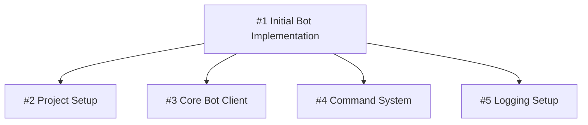

# GitHub Issue Policy

## Core Principle

**Decompose work into atomic, trackable units. Every non-trivial change requires an issue.**

## When Issues Are Mandatory

| Requires Issue | Optional |
|---------------|----------|
| New features | Typo corrections |
| Bug fixes needing investigation | Formatting-only changes |
| Architectural changes | Routine dependency bumps |
| Multi-file refactoring | Comment additions |
| Substantial documentation | |
| Performance optimization | |
| Security patches | |

## Issue Title Format

```
[#Parent-ID] Component: Imperative action description
```

**Examples:**
- `[#1] Project: Initialize uv with discord.py dependencies`
- `[#1] Bot: Implement core client with intents configuration`
- `Commands: Add slash command registration system` (no parent)

For child issues, ALWAYS prefix with `[#parent-id]`.

## Issue Body Structure

Every issue body MUST contain these sections in order:

### 1. Problem Statement
Explain WHAT needs to be done and WHY. Provide context for the change.

### 2. Acceptance Criteria
Define exact closure conditions. Use checkboxes:
```markdown
- [ ] Criterion one
- [ ] Criterion two
- [ ] All tests pass
```

### 3. Technical Scope
List specific files, modules, or systems affected:
```markdown
**Files:** `src/auth/`, `tests/test_auth.py`
**Dependencies:** `pyjwt>=2.0`
```

### 4. Sub-Issue Visualization (Parent Issues Only)
After a `---` separator, include a Mermaid diagram:
```markdown
---

## Sub-Issues

` ` `mermaid
graph TD
    A[#1 Parent Feature] --> B[#2 Child One]
    A --> C[#3 Child Two]
    A --> D[#4 Child Three]
` ` `
```

## Hierarchy Rules

### Parent Issues
- Represent high-level features or epics
- Remain OPEN until ALL child issues close
- MUST include Mermaid diagram when children exist
- Track overall progress via child completion

### Child Issues
- Address a SINGLE concern
- Implementable in ONE pull request
- Reference parent with `[#parent-id]` in title
- Each maps to exactly one PR

### Depth Limit
Maximum 2 levels: Parent → Child. If deeper decomposition needed, create a new parent.

## Mermaid Diagram Standards



**Rules:**
- Use `graph TD` (top-down) format
- Node pattern: `NodeID[#issue-number Title]`
- Keep descriptions under 40 characters
- Arrows flow parent → child only

## Branch Naming Convention

| Type | Pattern |
|------|---------|
| Parent feature | `feature/parent-number-description` |
| Child feature | `feature/parent-number/child-number-description` |
| Standalone bugfix | `bugfix/issue-number-description` |
| Hotfix | `hotfix/description` |

**Examples:**
- `feature/1-initial-bot-implementation`
- `feature/1/2-project-setup`
- `feature/1/3-core-bot-client`
- `bugfix/56-null-pointer-handler`

## Issue Lifecycle

```
Creation → Decomposition → Implementation → Integration → Closure
```

1. **Creation**: Write issue with full body template
2. **Decomposition**: Break into child issues if complex
3. **Implementation**: Each child → one branch → one PR
4. **Integration**: Child PRs merge, parent tracks progress
5. **Closure**: Parent closes when all children complete

## Commit Reference Format

Commits referencing issues use: `gh-<issue-number>: description`

## Labels Strategy

Apply labels consistently:
- **Type**: `feature`, `bug`, `enhancement`, `documentation`
- **Priority**: `P0-critical`, `P1-high`, `P2-medium`, `P3-low`
- **Status**: `needs-triage`, `in-progress`, `blocked`
- **Scope**: Component-specific labels matching project modules

## Enforcement

- PR templates MUST require issue references
- CI checks validate parent issues contain diagrams when children exist
- CI checks verify child issues reference parents in titles
- Parent issues cannot close while children remain open
