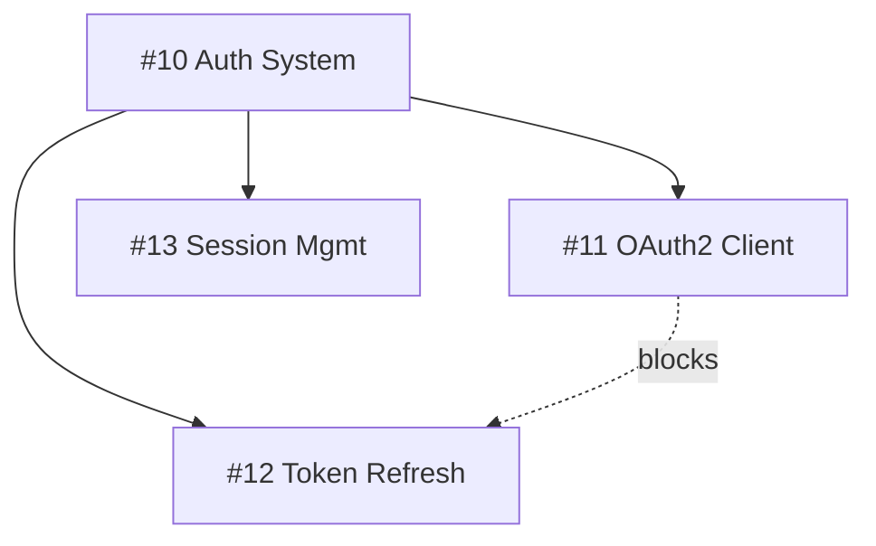

# GH SDLC — GitHub Software Development Lifecycle

## Activation Policy

**This workflow is OPT-IN only.** Do NOT run it automatically.

### When to activate:
1. **Slash command**: User runs `/gh-sdlc` (with optional arguments)
2. **Explicit mention**: User says "run the SDLC", "GH SDLC", "use the workflow", or similar
3. **Integration keywords**: User says "commit this", "push this", "ship it", "open a PR", "merge this", "let's get this merged", or any phrase implying code integration — this means **run the FULL pipeline**, not just that one git operation

### When NOT to activate:
- User asks to fix a bug → just fix it, don't create issues/PRs
- User asks to implement a feature → just implement it
- User asks to refactor code → just refactor
- User asks a question → just answer
- User asks to write tests → just write them

**The user will tell you when they want the SDLC.** Until then, just do the work.

## Use Cases

There are two ways users invoke this workflow, each with a different execution strategy:

### A) Upfront: Plan + Implement + Ship
The user invokes `/gh-sdlc <objective>` or describes an objective alongside the SDLC trigger BEFORE starting work. Run the full pipeline from Phase 1 (planning) through Phase 5 (tracking), including implementation.

**Execution:** The current model handles everything directly — no subagent.

### B) Retroactive: Ship completed work
The user has already done the work (code is written, changes exist) and now invokes `/gh-sdlc` or says "commit" / "ship it" to formalize it.

**Execution:** Delegate to the `sdlc-shipper` subagent. This subagent uses the latest Sonnet model (see [model overview](https://platform.claude.com/docs/en/about-claude/models/overview) — always use the `sonnet` alias, never hardcode a model ID) and has all five skills preloaded (commit-policy, issue-policy, pr-policy, gh-projects, gh-sdlc). It will first plan (dissect changes, validate decomposition, check for relevance) and only then execute the full SDLC pipeline autonomously.

**In both cases**, proper decomposition, issue creation, project tracking, branching, atomic commits, and PR creation MUST happen. The only difference is whether implementation occurs during the workflow (A) or has already occurred before it (B), and whether the current model or the `sdlc-shipper` subagent executes the pipeline.

## Interaction Mode

`$ARGUMENTS` is parsed for two things: an **interaction mode** and an optional **objective description**.

### Parsing rules:
1. If `$ARGUMENTS` starts with `interactive` → mode is **interactive**, rest is the objective
2. If `$ARGUMENTS` starts with `yolo` → mode is **yolo**, rest is the objective
3. If `$ARGUMENTS` is empty or has no mode keyword → mode is **yolo** (default), no explicit objective (use session context)
4. If `$ARGUMENTS` has content but no mode keyword → mode is **yolo** (default), entire argument is the objective

**Examples:**
- `/gh-sdlc` → yolo mode, ship whatever was done this session
- `/gh-sdlc interactive` → interactive mode, ship whatever was done this session
- `/gh-sdlc add OAuth2 support` → yolo mode, objective is "add OAuth2 support"
- `/gh-sdlc interactive add OAuth2 support` → interactive mode, objective is "add OAuth2 support"
- `/gh-sdlc yolo fix the login bug` → yolo mode, objective is "fix the login bug"

### Yolo Mode (default)

Make all decisions autonomously. No questions asked. Use best judgment for:
- Issue titles, descriptions, and decomposition
- Labels, milestones, project selection
- Branch names
- Commit message grouping
- PR title, description, and metadata
- Merge strategy

Just get it done.

**Delegation:** When no objective is provided (Use Case B), yolo mode delegates to the `sdlc-shipper` subagent, which always operates in yolo mode.

### Interactive Mode

**Delegation:** Interactive mode always runs in the current model (never delegates to the subagent), even for Use Case B. The user wants to be consulted at each step, which requires foreground interaction.

Use `AskUserQuestion` at each decision point. Present all relevant options, choices, and alternatives with context. Key decision points:

| Phase | Decisions to confirm |
|-------|---------------------|
| **Planning** | Issue title/description, decomposition into children (how many, what scope), labels to apply, milestone to assign, project to add to, priority level |
| **Implementation** | Which files to include, how to group changes into commits, commit messages |
| **PR Creation** | PR title, description content, labels, merge strategy preference, reviewer assignment |
| **Merge** | Confirm merge readiness, squash vs rebase, branch cleanup |

**Interactive mode format:** Present a clear question with numbered options where applicable. Include a recommended default. Example:
```
Issue decomposition — this work touches auth config and token refresh.

1. Single issue (simple, < 200 lines total)
2. Two child issues: OAuth2 config + Token refresh (recommended)
3. Three child issues: OAuth2 config + Token refresh + Tests

Which decomposition? (default: 2)
```

## Visualization & Communication

Use Mermaid diagrams, diffs, and codeblocks to communicate plans and progress — but only where they genuinely help. Don't force visuals onto simple tasks.

### When to use what:

| Situation | Tool |
|-----------|------|
| Complex branching plan (multiple sub-branches, remotes, parallel work) | **GitGraph** — show the branch/merge plan before linearization |
| Issue decomposition with dependencies | **Flowchart** (`graph TD`) — show parent→child relationships and blocked-by edges |
| State transitions (issue lifecycle, PR stages) | **State Diagram** — show how items flow through statuses |
| Workflow sequence (who does what when) | **Sequence Diagram** — show agent/human/CI interactions |
| Proposing code changes before making them | **Diff codeblocks** (` ```diff `) — show what will change |
| Explaining architecture or module relationships | **Mindmap**, **Block Diagram**, or **C4 Diagram** |
| Tracking parallel workstreams | **Kanban** — visualize what's in progress |

### GitGraph for complex branching

When a task involves multiple sub-issues with sub-branches, show the branching plan with a gitgraph before execution. This helps the user see the full picture before it gets linearized into squash merges on main.

Example for a 3-child decomposition:
````markdown
```mermaid
gitgraph
    commit id: "main"
    branch feature/10-auth
    checkout feature/10-auth
    branch feature/10/11-oauth2-client
    checkout feature/10/11-oauth2-client
    commit id: "gh-11: add OAuth2 config"
    commit id: "gh-11: implement auth flow"
    checkout feature/10-auth
    merge feature/10/11-oauth2-client id: "PR #20 → squash"
    branch feature/10/12-token-refresh
    checkout feature/10/12-token-refresh
    commit id: "gh-12: add token refresh"
    checkout feature/10-auth
    merge feature/10/12-token-refresh id: "PR #21 → squash"
    branch feature/10/13-sessions
    checkout feature/10/13-sessions
    commit id: "gh-13: add session mgmt"
    checkout feature/10-auth
    merge feature/10/13-sessions id: "PR #22 → squash"
    checkout main
    merge feature/10-auth id: "PR #23 → squash"
```
````

### Diff codeblocks for proposed changes

When presenting what will change (interactive mode especially), use diff syntax:
````markdown
```diff
- description: Enforces commit message formatting standards. Activates on any git commit.
+ description: "Commit message formatting standards (part of gh-sdlc). Does NOT auto-activate."
```
````

### Flowcharts for issue decomposition

Already required in parent issue bodies (see issue-policy). Use `graph TD` with `-->` for parent→child and `-.->` for dependency edges:
````markdown

````

### Guidelines

- **Don't visualize simple tasks.** A single-issue, single-branch change doesn't need a gitgraph.
- **Don't visualize milestones/releases as timelines.** No Gantt or Timeline diagrams for release scheduling.
- **Do visualize before executing** in interactive mode — show the plan, get approval, then run.
- **Do use inline codeblocks** for issue numbers (`#14`), branch names (`feature/10/11-oauth2`), and commit messages (`gh-11: add config`) in prose.

## Optics & Public-Facing Content

Issues, PRs, commit messages, and project board entries are **public artifacts**. They must be self-contained and meaningful to any reader — not just the agent and user who discussed them.

**Rules:**
- **Omit session context.** Don't reference intermediary conversations, corrections, or back-and-forth between agent and user. If the user asked to remove something and then add it back, the issue should only describe the final state — not the journey.
- **No internal jargon.** If a term only makes sense because of a prior conversation (e.g., "remove V2 references" when V2 was never a public concept), leave it out.
- **Write for a stranger.** Every issue, PR, and commit message should make sense to someone who has never seen the conversation that produced it.
- **Focus on the what and why, not the how-we-got-here.** Acceptance criteria describe the desired outcome, not the debugging steps that led to it.

## Coordinated Skills

This workflow orchestrates four policy skills:

| Skill | Responsibility |
|-------|---------------|
| **issue-policy** | Work decomposition, issue hierarchy, acceptance criteria |
| **gh-projects** | Project boards, fields, labels, milestones, tracking |
| **commit-policy** | Commit message formatting, atomic commits |
| **pr-policy** | PR creation, review, merge strategy, branch management |

## Workflow Phases

### Phase 1: Planning (issue-policy + gh-projects)

1. **Assess scope** — Determine if work needs an issue (see issue-policy mandatory criteria)
2. **Create parent issue** if work is non-trivial:
   - Title: `Component: Imperative action description`
   - Body: Problem statement, acceptance criteria, technical scope
   - Assign to user (`--assignee "@me"`)
3. **Decompose** into child issues if complex:
   - Each child: single concern, one PR, title prefixed `[#parent-id]`
   - Assign each child to user (`--assignee "@me"`)
   - Add Mermaid diagram to parent
   - **Link as sub-issues** via GraphQL API (not just title prefix)
   - Mark dependencies (blocked by/blocking) where execution order matters
4. **Set up project tracking:**
   - Add issues to project board (`gh project item-add`)
   - Apply labels: use existing labels, only create when no match exists
   - Assign milestone
   - Set custom field values (Status, Priority, Story Points)
5. **Create branches:**
   - Parent: `feature/<parent-number>-<description>`
   - Children: `feature/<parent-number>/<child-number>-<description>`
   - **Always** create sub-branches for sub-issues — if the issue was decomposed, the branch must be too

### Phase 2: Implementation (commit-policy)

1. **Work on one child issue at a time** on its feature branch
2. **Make atomic commits** following commit-policy:
   - Issue-tracked: `gh-<issue>: <imperative summary>`
   - Untracked: `<type>(<scope>): <imperative summary>`
3. **Organize commits logically:**
   - Infrastructure/setup first
   - Core implementation
   - Tests
   - Documentation
4. **Use fixup workflow** for incremental fixes during development:
   ```bash
   git commit --fixup=<target-hash>
   ```

**For retroactive use (Use Case B):** Code already exists. Analyze the diff, create the branch, stage and commit changes with proper atomic commits and messages. Do not re-implement — just formalize.

### Phase 3: PR Creation (pr-policy + gh-projects)

1. **Clean commit history:**
   ```bash
   git rebase -i --autosquash origin/main
   ```
2. **Self-review checklist** (pr-policy)
3. **Create PR:**
   - Title: `[#issue] Component: Imperative description`
   - Body: Changes, issue reference (`Closes #N`), testing, checklist
   - Apply labels (existing ones), set project, set milestone
   - Assign user as reviewer (`--reviewer <username>`) and assignee
   - Size: Aim for < 200 lines changed
4. **Update project board:**
   - Move item status to "In Review"
   - Ensure labels reflect current state
5. **Check boxes** as each item completes. Report any that cannot be satisfied.

### Phase 4: Review & Merge (pr-policy + commit-policy)

1. **Address feedback:**
   - Small changes: `git commit --fixup=<hash>`
   - Substantial: new commit with proper message
2. **Before merge:** Squash all fixups: `git rebase -i --autosquash origin/main`
3. **Merge strategy selection:**
   - Default: **Squash and merge** (one commit per PR in main)
   - Rebase merge: Only if commit history is intentionally structured
   - **Never** merge commits
4. **Post-merge cleanup:**
   - Delete feature branch
   - Update project board: move to "Done"
   - Close child issue (auto-closes via `Closes #N`)
   - Check if parent issue can close (all children done)

### Phase 5: Tracking & Maintenance (gh-projects)

1. **Update milestone progress** — check open/closed issue counts
2. **Archive completed items** on project board
3. **Review blocked items** — update labels, reassign
4. **Close milestones** when all issues resolved

## Decision Matrix

| Task | Skills Involved |
|------|----------------|
| "Plan a new feature" | issue-policy → gh-projects |
| "Implement this function" | commit-policy |
| "Open a PR for this work" | pr-policy → gh-projects |
| "Fix this bug" | issue-policy → commit-policy → pr-policy |
| "Set up project tracking" | gh-projects |
| "Review this PR" | pr-policy |
| "Create a release" | gh-projects (milestones) → pr-policy |
| "Decompose this epic" | issue-policy → gh-projects |
| "Clean up commit history" | commit-policy → pr-policy |
| "Full feature lifecycle" | ALL (in order: plan → implement → PR → merge → track) |

## Integrated Example: Full Feature Lifecycle

Given: `/gh-sdlc Add user authentication`

**Step 1 — Plan (issue-policy + gh-projects):**
```bash
# Create parent issue
gh issue create --title "Auth: Implement user authentication system" \
  --body "## Problem Statement
Application needs user authentication.

## Acceptance Criteria
- [ ] Login/logout endpoints
- [ ] JWT token handling
- [ ] Session management
- [ ] Tests pass

## Technical Scope
**Files:** \`src/auth/\`, \`tests/test_auth.py\`
---
## Sub-Issues
\`\`\`mermaid
graph TD
    A[#10 User Authentication] --> B[#11 OAuth2 Client]
    A --> C[#12 Token Refresh]
    A --> D[#13 Session Management]
\`\`\`" \
  --label "feature,P1-high" --milestone "v1.0"

# Create child issues
gh issue create --title "[#10] Auth: Set up OAuth2 client" --label "feature" --milestone "v1.0"
gh issue create --title "[#10] Auth: Implement token refresh" --label "feature" --milestone "v1.0"
gh issue create --title "[#10] Auth: Add session management" --label "feature" --milestone "v1.0"

# Add to project
gh project item-add 1 --owner "@me" --url "$(gh issue view 10 --json url -q .url)"
gh project item-add 1 --owner "@me" --url "$(gh issue view 11 --json url -q .url)"
# ... for each issue
```

**Step 2 — Implement (commit-policy):**
```bash
git checkout -b feature/10/11-oauth2-client

# Atomic commits
git commit -m "gh-11: add OAuth2 client configuration"
git commit -m "gh-11: implement authorization code flow"
git commit -m "gh-11: add OAuth2 client tests"
```

**Step 3 — PR (pr-policy):**
```bash
# Clean history
git rebase -i --autosquash origin/main
git push --force-with-lease

# Create PR
gh pr create --title "[#11] Auth: Set up OAuth2 client" \
  --body "## Changes
- OAuth2 client with PKCE support
- Configuration via environment variables

## Issue Reference
Closes #11

## Testing
- [ ] Unit tests added
- [ ] Integration test passes"
```

**Step 4 — Merge (pr-policy + gh-projects):**
```bash
# After approval, squash merge
# Update project: item → "Done"
# Delete branch
git branch -d feature/10/11-oauth2-client
```

**Step 5 — Track (gh-projects):**
```bash
# Check parent progress
gh issue view 10
# When all children (#11, #12, #13) closed → close parent
gh issue close 10
# Update milestone
gh api repos/{owner}/{repo}/milestones/1 --jq '{open_issues, closed_issues}'
```

## Conflict Resolution Between Skills

When skills have overlapping guidance:

1. **commit-policy** governs commit message format — always
2. **pr-policy** governs PR title/description format — always
3. **issue-policy** governs issue structure — always
4. **gh-projects** governs project board state — always
5. For branch naming: issue-policy and pr-policy agree — follow the `feature/parent/child` convention
6. For merge strategy: pr-policy decides (default squash)

## Automation Patterns

### Script: Full Issue-to-Project Pipeline
```bash
# Create issue, add to project, set fields — all in one flow
ISSUE_URL=$(gh issue create --title "$TITLE" --label "$LABELS" --milestone "$MILESTONE" --json url -q .url)
ITEM_ID=$(gh project item-add $PROJECT_NUM --owner "@me" --url "$ISSUE_URL" --format json --jq '.id')
gh project item-edit --id "$ITEM_ID" --field-id "$PRIORITY_FIELD_ID" --single-select-option-id "$P1_OPTION_ID"
gh project item-edit --id "$ITEM_ID" --field-id "$STATUS_FIELD_ID" --single-select-option-id "$TODO_OPTION_ID"
```

### When to Use Agent Teams

For large-scale work (epics with 5+ children), consider using agent teams:
- **Lead**: Coordinates overall planning and tracks progress
- **Planner teammate**: Creates issues, sets up project board (issue-policy + gh-projects)
- **Implementer teammates**: Each works on a child issue in its own worktree (commit-policy)
- **Reviewer teammate**: Reviews PRs as they come in (pr-policy)

This parallelizes the workflow while maintaining policy compliance across all phases.
