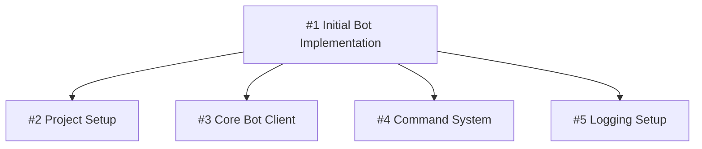

# GitHub Issue Policy

## Core Principle

**Decompose work into atomic, trackable units. Every non-trivial change requires an issue.**

## Assignment Rules

- ALWAYS assign the user themselves (`--assignee "@me"`) unless user explicitly opted out
- For child issues, inherit the parent's assignee unless specified otherwise
- Never leave issues unassigned

## When Issues Are Mandatory

| Requires Issue | Optional |
|---------------|----------|
| New features | Typo corrections |
| Bug fixes needing investigation | Formatting-only changes |
| Architectural changes | Routine dependency bumps |
| Multi-file refactoring | Comment additions |
| Substantial documentation | |
| Performance optimization | |
| Security patches | |

## Issue Title Format

```
Component: Imperative action description
```

**Examples:**
- ``Project: Initialize `uv` with `discord.py` dependencies``
- ``Bot: Implement core client with intents configuration``
- ``Commands: Add slash command registration system``

Use inline codeblocks (backtick wrapping) for filenames, flags, tool/package names, and directory paths in titles. See commit-policy for the full codeblock usage guide.

Child issues use the same format — no bracket prefixes. Parent-child relationships are expressed via sub-issue linking (GraphQL API), not title conventions.

## Issue Body Structure

Every issue body MUST contain these sections in order:

### 1. Problem Statement
Explain WHAT needs to be done and WHY. Provide context for the change.

### 2. Acceptance Criteria
Define exact closure conditions. Use checkboxes:
```markdown
- [ ] Criterion one
- [ ] Criterion two
- [ ] All tests pass
```

### 3. Technical Scope
List specific files, modules, or systems affected:
```markdown
**Files:** `src/auth/`, `tests/test_auth.py`
**Dependencies:** `pyjwt>=2.0`
```

### 4. Sub-Issue Visualization (Parent Issues Only)
After a `---` separator, include a Mermaid diagram:
```markdown
---

## Sub-Issues

` ` `mermaid
graph TD
    A[#1 Parent Feature] --> B[#2 Child One]
    A --> C[#3 Child Two]
    A --> D[#4 Child Three]
` ` `
```

## Hierarchy Rules

### Parent Issues
- Represent high-level features or epics
- Remain OPEN until ALL child issues close
- MUST include Mermaid diagram when children exist
- Track overall progress via child completion

### Child Issues
- Address a SINGLE concern
- Implementable in ONE pull request
- Linked to parent via sub-issue API (not title prefix)
- Each maps to exactly one PR

### Depth Limit
Maximum 2 levels: Parent → Child. If deeper decomposition needed, create a new parent.

## Issue Relationships (Sub-Issues & Dependencies)

Use GitHub's native relationship features to formally link issues. This replaces informal "see #N" references.

### Sub-Issues (Parent-Child Hierarchy)

After creating parent and child issues, link them as sub-issues via the GraphQL API:

```bash
# Get issue node IDs
PARENT_ID=$(gh issue view <parent-number> --json id -q '.id')
CHILD_ID=$(gh issue view <child-number> --json id -q '.id')

# Add child as sub-issue of parent
gh api graphql -f query='
  mutation {
    addSubIssue(input: {
      issueId: "'$PARENT_ID'"
      subIssueId: "'$CHILD_ID'"
    }) {
      issue { id }
      subIssue { id }
    }
  }'
```

**Rules:**
- ALWAYS link child issues as sub-issues after creation — do not rely on title prefixes alone
- Sub-issues appear in the parent's sidebar and project boards automatically
- Parent progress tracks sub-issue completion natively

### Removing Sub-Issues

```bash
gh api graphql -f query='
  mutation {
    removeSubIssue(input: {
      issueId: "'$PARENT_ID'"
      subIssueId: "'$CHILD_ID'"
    }) {
      issue { id }
      subIssue { id }
    }
  }'
```

### Dependencies (Blocked By / Blocking)

Use dependency relationships when issues have execution-order constraints:

- **Blocked by**: This issue cannot proceed until another completes
- **Blocking**: This issue prevents another from starting

Dependencies are managed via the GitHub UI (Relationships sidebar) or the MCP server's `sub_issue_write` tool. Apply when:
- A child issue requires another child's output (e.g., DB migration before API layer)
- External dependencies block progress

**Rules:**
- Mark dependencies explicitly; do not assume order from issue numbers
- Blocked issues should carry the `blocked` label
- When a blocking issue closes, review and unblock dependents

## Mermaid Diagram Standards



**Rules:**
- Use `graph TD` (top-down) format
- Node pattern: `NodeID[#issue-number Title]`
- Keep descriptions under 40 characters
- Arrows flow parent → child only

## Branch Naming Convention

| Type | Pattern |
|------|---------|
| Parent feature | `feature/parent-number-description` |
| Child feature | `feature/parent-number/child-number-description` |
| Standalone bugfix | `bugfix/issue-number-description` |
| Hotfix | `hotfix/description` |

**Examples:**
- `feature/1-initial-bot-implementation`
- `feature/1/2-project-setup`
- `feature/1/3-core-bot-client`
- `bugfix/56-null-pointer-handler`

**Rule:** When child issues exist, ALWAYS create corresponding sub-branches. Every child issue gets its own `feature/parent/child-description` branch — no exceptions. Sub-branches mirror sub-issues: if you decomposed the issue, decompose the branch.

## Issue Lifecycle

```
Creation → Decomposition → Implementation → Integration → Closure
```

1. **Creation**: Write issue with full body template
2. **Decomposition**: Break into child issues if complex
3. **Implementation**: Each child → one branch → one PR
4. **Integration**: Child PRs merge, parent tracks progress
5. **Closure**: Parent closes when all children complete

## Commit Reference Format

Commits referencing issues use: `gh-<issue-number>: description`

## Labels Strategy

Apply labels consistently:
- **Type**: `feature`, `bug`, `enhancement`, `documentation`
- **Priority**: `P0-critical`, `P1-high`, `P2-medium`, `P3-low`
- **Status**: `needs-triage`, `in-progress`, `blocked`
- **Scope**: Component-specific labels matching project modules

## Issue Creation Command

Always use `--body-file` to pass issue bodies — never inline markdown in `--body "..."` because backticks, code blocks, and special characters get mangled by shell interpretation.

```bash
# Write body to temp file (markdown is preserved exactly)
cat > /tmp/issue-body.md <<'EOF'
## Problem Statement
Description of what needs to be done and why.

## Acceptance Criteria
- [ ] Criterion one
- [ ] Criterion two

## Technical Scope
**Files:** `src/module/`, `tests/test_module.py`
EOF

gh issue create \
  --title "Component: Action description" \
  --body-file /tmp/issue-body.md \
  --label "feature" \
  --milestone "vX.Y" \
  --assignee "@me"

rm /tmp/issue-body.md
```

After creating child issues, ALWAYS link them as sub-issues of the parent (see "Issue Relationships" above).

## Acceptance Criteria Checkbox Management

**Tick acceptance criteria checkboxes as work progresses.** When a criterion is satisfied (code written, test passing, feature working), update the issue body to mark it `[x]`.

### How to tick checkboxes

```bash
# Fetch current body, apply sed, write to temp file, update via --body-file
gh issue view <number> --json body -q .body \
  | sed 's/- \[ \] Criterion text/- [x] Criterion text/' \
  > /tmp/updated-body.md
gh issue edit <number> --body-file /tmp/updated-body.md
```

### Rules

- Tick each criterion as soon as it is verifiably met — don't wait until the end
- If a criterion cannot be met, add an inline note explaining why (e.g., `- [ ] ~~N/A: no external API~~ Criterion text`)
- Before closing an issue, all acceptance criteria must be ticked or explicitly documented as not applicable
- Parent issue criteria should reflect child issue completion

## Enforcement

- PR templates MUST require issue references
- CI checks validate parent issues contain diagrams when children exist
- CI checks verify child issues are linked as sub-issues of their parent
- Parent issues cannot close while children remain open
- All child issues MUST be linked as sub-issues via the API
